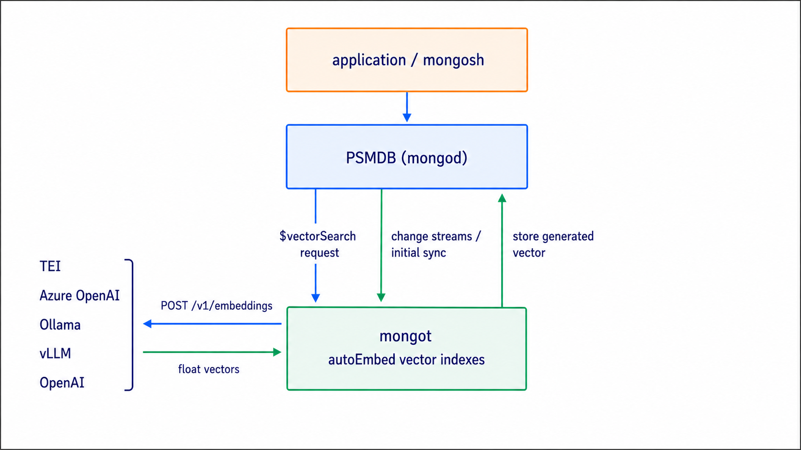
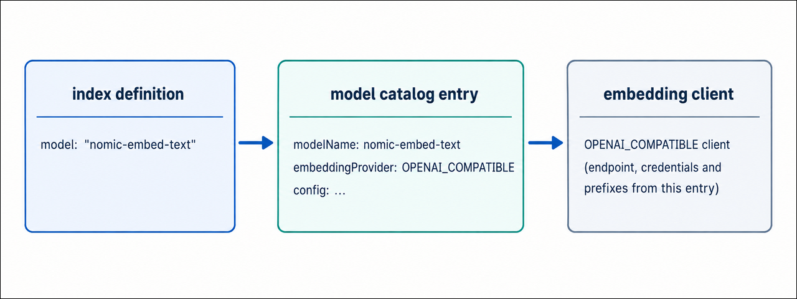

# Automatic embedding with OpenAI-Compatible Providers

Percona Search for MongoDB can generate vector embeddings using any embedding server that implements the OpenAI `/v1/embeddings` API. The `OPENAI_COMPATIBLE` embedding provider makes this possible.

!!! warning "Technical preview"
    Percona Search for MongoDB 1.70.3-1 is available as a technical preview.

    We recommend that early adopters use this release for testing purposes only and not in production environments.

## Why this matters

Automatic embedding for autoEmbed vector search indexes in MongoDB upstream requires a Voyage AI API key, creating a dependency on a third-party cloud service and per-token costs. Percona Search for MongoDB removes this dependency by providing automatic embedding without requiring a paid third-party model, eliminating the associated API costs and external service dependency.

With the `OPENAI_COMPATIBLE` provider, you have more flexibility in how and where embeddings are generated. You can:

- Run embedding models locally to keep data within your infrastructure and avoid usage-based API costs.

- Use hosted services such as OpenAI or Azure OpenAI.

- Configure Voyage and OpenAI-compatible models on the same mongot instance.

## OpenAI-compatible embedding providers

The `OPENAI_COMPATIBLE` provider works with engines that implement the `OpenAI /v1/embeddings` API.

!!! note
    The following table lists common examples. The ports are typical defaults. Check the configuration of your embedding server before using them.

| **Engine**| **Typical endpoint** | **Authentication**|
| ------| -----------------| --------------|
| [Ollama :octicons-link-external-16:](https://ollama.com/){:target="_blank"}               | `http://localhost:11434/v1/embeddings` | Not required by default       |
| vLLM                                         | `http://localhost:8000/v1/embeddings`  | Not required by default       |
| llama.cpp server                             | `http://localhost:8080/v1/embeddings`  | Not required by default       |
| LM Studio                                    | `http://localhost:1234/v1/embeddings`  | Not required by default       |
| LocalAI                                      | `http://localhost:8080/v1/embeddings`  | Not required by default       |
| Hugging Face Text Embeddings Inference (TEI) | `http://localhost:8080/v1/embeddings`  | Not required by default       |
| OpenAI                                       | `https://api.openai.com/v1/embeddings` | `Authorization: Bearer <key>` |
| Azure OpenAI                                 | Deployment-specific endpoint           | `api-key: <key>`              |

## What to know before you start

- Only **float** vector output is currently supported. `int8` and binary quantization aren't supported.
- `outputDimensions` in the catalog must match the dimensions returned by the model, unless you set `forwardDimensions: true`.
- Local engines commonly return vectors with a fixed dimension. They can reject requests that contain the OpenAI `dimensions` field.
- The global `embedding.providerEndpoint` override applies to **VOYAGE models only**. Each `OPENAI_COMPATIBLE` model carries its own `providerEndpoint` in the catalog.
- Local engines can run without an API key when authentication isn't configured.

## How automatic embedding works

### Overview

With manual embedding, your application is responsible for generating embeddings before storing or querying data. However, automatic embedding moves this work to `mongot`.

When you create a vector search index with an `autoEmbed` field, `mongot` embeds the indexed text during the initial collection scan and then keeps embedding it as documents change, using change streams. At query time, the text you pass to `$vectorSearch` goes through the same model, with the model's query prefix applied if one is configured, and is matched against the stored vectors.

## How `mongot` selects an embedding provider

The embedding provider isn't selected globally in `mongot.conf`. It is configured for each model in `embedding-service-configs.yml`.

`mongot` resolves the embedding provider and settings from the model name:
{.power-number}

1. The index definition names a model, for example `{ type: "autoEmbed", model: "nomic-embed-text", ... }`.
2. `mongot` finds the catalog entry whose `modelName` matches.
3. The entry's `embeddingProvider` field, either `VOYAGE` or `OPENAI_COMPATIBLE`, decides which client handles the traffic. Everything else the client needs, including `providerEndpoint`, credentials, prefixes, and batching, comes from the same entry.

!!! note
    Both provider types can run on the same `mongot` instance. When you create an `autoEmbed` index, the model name determines which provider and model configuration mongot uses. The embedding section in `mongot.conf` contains settings shared across the automatic embedding setup, such as the model catalog path and Voyage-specific configuration.

## Next steps

Choose the engine you want to connect:

[Configure automatic embedding with Ollama :material-arrow-right:](configure-automatic-embedding-ollama.md){.md-button} 

[Configure automatic embedding with OpenAI :material-arrow-right:](configure-automatic-embedding-openai.md){.md-button} 

[Configure automatic embedding with Azure OpenAI :material-arrow-right:](configure-automatic-embedding-openai-azure.md){.md-button}

