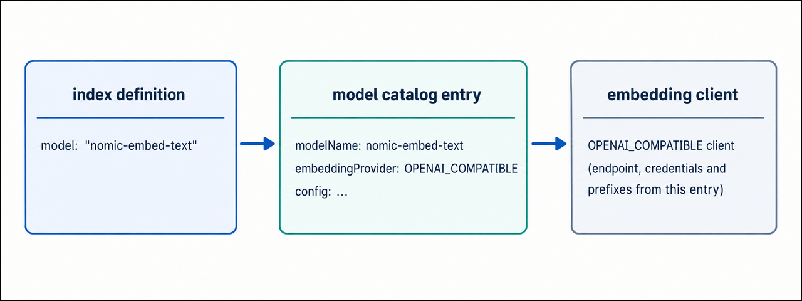

# Automatic embedding configuration

With automatic embedding, `mongot` generates vector embeddings for you. You don't have to build an embedding pipeline in your application. `mongot` embeds your documents when it indexes them, keeps the embeddings up to date as documents change, and embeds the query text when you run `$vectorSearch`.

Percona Search for MongoDB can send this work to hosted embedding services, such as OpenAI or the Hugging Face Inference API, or to an embedding server that you run yourself, such as Ollama. This page lists the supported providers, explains how `mongot` uses them, and shows the general configuration procedure.

## Supported providers

Each model in the model catalog uses one of the following providers. The provider is set by the `embeddingProvider` field of the model's catalog entry.

| **Provider** | **Embedding services** | **Setup guide** |
| --- | --- | --- |
| `VOYAGE` | [Voyage AI :octicons-link-external-16:](https://www.voyageai.com/){:target="_blank"} hosted models. The default catalog includes `voyage-4-large`, `voyage-4`, `voyage-4-lite`, and `voyage-code-3`. | [Configuration reference](automatic-embedding-configuration-reference.md) |
| `OPENAI_COMPATIBLE` | Any service that implements the OpenAI `/v1/embeddings` API: OpenAI, Azure OpenAI, Ollama, vLLM, llama.cpp, LM Studio, LocalAI, and Hugging Face Text Embeddings Inference (TEI) | [OpenAI-compatible providers](automatic-embedding-with-OpenAI-providers.md) |
| `HUGGINGFACE_INFERENCE` | The hosted Hugging Face Inference API, dedicated Hugging Face Inference Endpoints, and the native `/embed` route of a self-hosted TEI server | [Hugging Face Inference API](configure-automatic-embedding-huggingface.md) |

You can configure models from several providers on the same `mongot` instance.

!!! note

    Only **float** vector output is supported for `OPENAI_COMPATIBLE` and `HUGGINGFACE_INFERENCE` models. Scalar and binary output formats aren't supported.

## How automatic embedding works

### Configuration files

Automatic embedding uses two configuration files:

- **The `embedding` section in `mongot.conf`.** Automatic embedding turns on as soon as this section exists. It holds settings that apply to all models, such as which `mongot` node writes the embeddings, the path to the model catalog, and the Voyage AI key files.
- **The model catalog, `embedding-service-configs.yml`.** It defines each embedding model: its provider, endpoint, credentials, output dimensions, batching, prefixes, and retry behavior. The catalog is installed next to the `mongot` binary. You can point `mongot` to your own copy with `embedding.modelConfigFile`.

### Indexing and querying

When you create a Vector Search index with an `autoEmbed` field, `mongot` does the following:
{.power-number}

1. During the initial collection scan, `mongot` sends the text of the indexed field to the embedding provider in batches and stores the returned vectors.
2. As documents change, `mongot` reads the changes from change streams and embeds the new or updated text.
3. When you run `$vectorSearch` with a text `query`, `mongot` embeds the query with the same model, adding the model's query prefix if one is configured. Then it matches the query vector against the stored vectors.


### How `mongot` selects a provider

You don't select a provider globally. `mongot` resolves it from the model name in the index definition:
{.power-number}

1. The index definition names a model, for example `{ type: "autoEmbed", model: "nomic-embed-text", ... }`.
2. `mongot` finds the catalog entry whose `modelName` matches.
3. The entry's `embeddingProvider` field decides which client sends the requests. Everything else that the client needs, including the endpoint, credentials, prefixes, and batching, comes from the same entry.



When `mongot` starts, it skips any model whose credentials are missing, for example Voyage models without key files, and logs a warning. The remaining models still load.

## Procedure

To configure automatic embedding, do the following:
{.power-number}

1. Make sure that the embedding service is reachable.

    Percona Server for MongoDB and Percona Search for MongoDB must be configured and running, and the `mongot` host must be able to reach the embedding service. Send a test request from the `mongot` host before you configure `mongot`. For example, for OpenAI:

    ```sh
    curl -s https://api.openai.com/v1/embeddings \
      -H "Content-Type: application/json" \
      -H "Authorization: Bearer <your-openai-api-key>" \
      -d '{
        "model": "text-embedding-3-small",
        "input": ["hello"]
      }'
    ```

    A successful response contains an embedding vector. This confirms that the model is available and that your credentials work. Each setup guide shows the test request for its service.

2. Enable automatic embedding in `mongot`.

    Add an `embedding` section to the active `mongot` configuration file. For the documented systemd installation, edit `/etc/mongot/config.yml`. The presence of this section activates automatic embedding:

    ```yaml
    embedding:
      isAutoEmbeddingViewWriter: true
    ```

    !!! info "Important"

        Set `isAutoEmbeddingViewWriter: true` on exactly one `mongot` node. That node writes the embedding materialized view. If several `mongot` instances serve the same data, configure only one of them as the writer.

3. Configure the model in the catalog.

    Add an entry for your model to `embedding-service-configs.yml`. To keep the default catalog unchanged, create a copy and set its path with `embedding.modelConfigFile`.

    === "OpenAI"

        ```yaml
        configs:
          - modelName: text-embedding-3-small
            embeddingProvider: OPENAI_COMPATIBLE
            config:
              providerEndpoint: https://api.openai.com/v1/embeddings

              modelConfig:
                batchSize: 96
                batchTokenLimit: 120000
                outputDimensions: 1536
                quantization: float
                # text-embedding-3 models support Matryoshka dimension reduction
                forwardDimensions: true

              errorHandlingConfig:
                maxRetries: 10
                initialRetryWaitMs: 200
                maxRetryWaitMs: 10000
                jitter: 0.1

              credentials:
                apiKey: "<your-openai-api-key>"
        ```

    === "Azure OpenAI"

        ```yaml
        configs:
          - modelName: text-embedding-3-small
            embeddingProvider: OPENAI_COMPATIBLE
            config:
              providerEndpoint: https://<resource>.openai.azure.com/openai/deployments/<deployment>/embeddings?api-version=2024-02-01

              modelConfig:
                batchSize: 96
                batchTokenLimit: 120000
                outputDimensions: 1536
                quantization: float
                forwardDimensions: true

              errorHandlingConfig:
                maxRetries: 10
                initialRetryWaitMs: 200
                maxRetryWaitMs: 10000
                jitter: 0.1

              credentials:
                apiKey: "<your-azure-openai-api-key>"
                authHeaderName: api-key
        ```

        For details, see [Configure automatic embedding with Azure OpenAI](configure-automatic-embedding-openai-azure.md).

    === "Ollama"

        ```yaml
        configs:
          - modelName: nomic-embed-text
            embeddingProvider: OPENAI_COMPATIBLE
            config:
              providerEndpoint: http://localhost:11434/v1/embeddings

              modelConfig:
                batchSize: 96
                batchTokenLimit: 120000
                outputDimensions: 768
                quantization: float
                # asymmetric model: queries and documents use different prefixes
                queryPrefix: "search_query: "
                documentPrefix: "search_document: "

              errorHandlingConfig:
                maxRetries: 10
                initialRetryWaitMs: 200
                maxRetryWaitMs: 10000
                jitter: 0.1

              credentials: {}
        ```

        The default catalog already contains this entry and a `bge-m3` entry. For details, see [Configure automatic embedding with Ollama](configure-automatic-embedding-ollama.md).

    === "Hugging Face"

        ```yaml
        configs:
          - modelName: bge-small-en-v1.5
            embeddingProvider: HUGGINGFACE_INFERENCE
            config:
              modelConfig:
                # exact, case-sensitive Hugging Face Hub repository ID
                modelId: BAAI/bge-small-en-v1.5
                batchSize: 32
                batchTokenLimit: 120000
                outputDimensions: 384
                quantization: float

              errorHandlingConfig:
                maxRetries: 10
                initialRetryWaitMs: 500
                maxRetryWaitMs: 30000
                jitter: 0.1

              credentials:
                apiToken: "<your-hugging-face-access-token>"
        ```

        For details, see [Configure automatic embedding with the Hugging Face Inference API](configure-automatic-embedding-huggingface.md).

    === "Voyage AI"

        The default catalog already contains the Voyage AI models, so you don't need to add a catalog entry. Instead, set the API key files in the `embedding` section of `mongot.conf`:

        ```yaml
        embedding:
          isAutoEmbeddingViewWriter: true
          queryKeyFile: /etc/mongot/voyage-api-query-key
          indexingKeyFile: /etc/mongot/voyage-api-indexing-key
        ```

        Configure both files. If they aren't set, `mongot` skips the Voyage models at startup.

    Restart `mongot` after you change the catalog.

    !!! info "Important"

        A catalog entry that contains an API key or token holds a secret. Restrict the file so that only the account running `mongot` can read it, and keep it out of version control.

4. Check the authentication settings.

    `mongot` redacts API keys and tokens from its logs and error messages. Each provider sends credentials as follows:

    - `OPENAI_COMPATIBLE`: When `authHeaderName` isn't set, `mongot` sends `credentials.apiKey` in the standard `Authorization` header with the Bearer scheme, which is what OpenAI expects. Set `authHeaderName: api-key` for Azure OpenAI. Use `credentials: {}` for local engines that don't require a key.
    - `HUGGINGFACE_INFERENCE`: `mongot` sends `credentials.apiToken` as `Authorization: Bearer <token>`.
    - `VOYAGE`: `mongot` reads the keys from `queryKeyFile` and `indexingKeyFile`.

5. Set the vector dimension.

    Set `outputDimensions` to the size of the vectors that the model returns. `mongot` uses this value to size the index, so you don't need to set `numDimensions` in the index definition.

    Some models, such as the OpenAI and Azure OpenAI `text-embedding-3` models, can return vectors shorter than their native size. For these models, set `forwardDimensions: true`, and `mongot` sends the index dimension in the OpenAI `dimensions` request field. Shorter vectors use less storage and memory, at some cost to accuracy.

    !!! info "Important"

        Use `forwardDimensions` only with models that support the `dimensions` parameter. Most local engines and Hugging Face models return a fixed dimension and may reject the field. For these models, leave `forwardDimensions` unset and make sure `outputDimensions` matches the model's native dimension.

6. Start `mongot` and check the startup output:

    ```sh
    systemctl start mongot
    ```

    Confirm that your model appears in the loaded model count. Warnings about skipped Voyage models are expected if you haven't configured Voyage credentials.

For a description of every setting, see the [Automatic embedding configuration reference](automatic-embedding-configuration-reference.md). If a model doesn't load or embedding fails, see [Troubleshoot automatic embedding](troubleshooting.md#automated-embedding).

## Next steps

[Create and query an autoEmbed index :material-arrow-right:](autoembed-index.md){.md-button}
