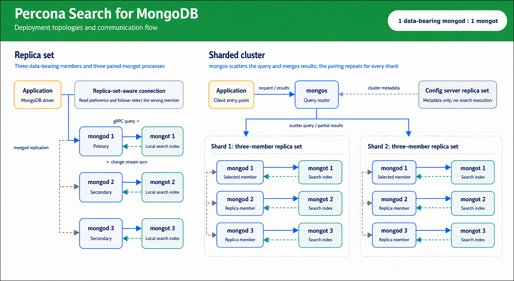

# Percona Search deployment

Percona Search for MongoDB runs as a separate `mongot` process alongside Percona Server for MongoDB. The deployment topology determines how many `mongot` instances are required and how search requests are routed.

Applications continue to connect to `mongod` in a replica set or to `mongos` in a sharded cluster. They never connect directly to `mongot`.

## Replica set deployment

One `mongot` deployment serves the complete data-bearing replica set. All `mongod` members use the same `mongot` endpoint for search operations.

When the application submits a search query:
{.power-number}

1. The application sends the query to a `mongod` member.
2. `mongod` forwards the search stage to mongot over gRPC.
3. `mongot` searches its indexes and returns matching document identifiers and scores.
4. `mongod` retrieves the matching documents and returns them to the application.
A three-member replica set therefore has three `mongod` processes and one mongot deployment.

## Sharded cluster deployment

In a sharded cluster, deploy one `mongot` for each data-bearing shard. The config server replica set does not require `mongot`.

The application sends search queries to `mongos`, which coordinates the request:
{.power-number}

1. `mongos` forwards the query to each relevant shard.
2. A `mongod` member on each shard forwards the search stage to that shard’s mongot.
3. Each `mongot` searches its local indexes and returns document identifiers and scores.
4. The shards retrieve the matching documents and return their partial results to `mongos`.
5. `mongos` merges and ranks the results before returning them to the application.

For example, a cluster with two three-member shards has six data-bearing mongod processes and two `mongot` deployments.

